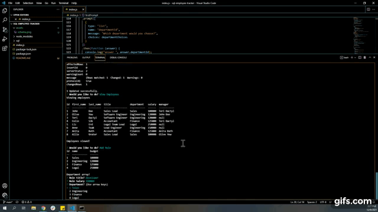

# MySQL Employee Tracker

## 12 SQL: Employee Tracker

## Task: 
Architect and build a solution for managing a company's employees using node, inquirer, and MySQL.

## Instructions

Design the database schema as shown in the following image:


## User Story

```
As a business owner
I want to be able to view and manage the departments, roles, and employees in my company
So that I can organize and plan my business
```

## Walk-through video:

[Click to watch example walk-through video](https://www.youtube.com/watch?v=vpJIoaVJUPY)

 


## Contact Me:
 [Github](https://github.com/bripap)  

